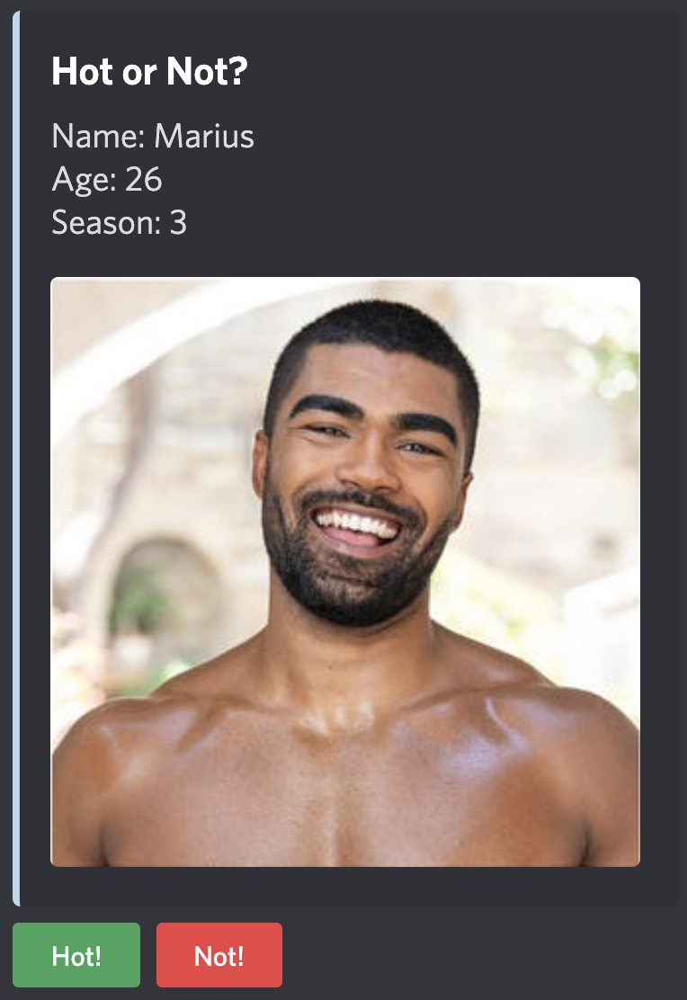
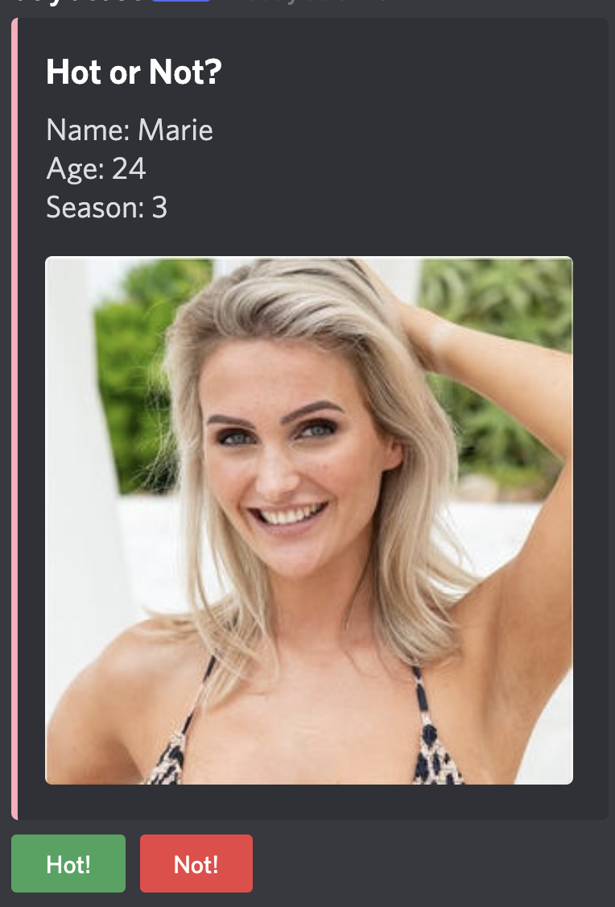

<div align="center">
  <br>
  <a href="http://dayo-project.herokuapp.com/">
  
  </a>
  <br>
</div>
<div align='center'>
    <small>
    <a href="https://github.com/alexsc23">Alex</a>,
    <a href="https://github.com/TheMuppet">Luca</a>,
    <a href="https://github.com/Lesoge">Fabian</a>, and
    <a href="https://github.com/xTomsko">Tom</a>
  </small>
</div>

---

<div align="center">
  <a href="https://deno.land">
    
  </a>
  <a href="https://svelte.dev">
    
  </a>
  <a href="https://www.mongodb.com">
    
  </a>
    <a href="https://www.heroku.com">
    
  </a>
</div>
<div align='center'>
  <a href="https://www.typescriptlang.org">
    
  </a>
</div>

## What is DAYO :interrobang:

**DAYO** (**D**iscord-Bot "**A**re **Y**ou the **O**ne?") is a
[Discord](https://discord.com)-Bot 🤖 to expose the most likely matches in the
super-hot 🥵 TV show "Are You the One?".

Place bets 💸 with your friends at the start of each season and find out who
calls the most matches correctly! ✅

After each episode, you get the most sizzling 🔥 news and probabilities to
uncover if your bet might be correct! 💪

## How to use DAYO 🤖

To have DAYO at your next watch-party you simply have to invite him to your
Discord Server! 💅

<div align='center'>
  <a href="https://discord.com/api/oauth2/authorize?client_id=941819203739074601&permissions=274877959168&scope=bot%20applications.commands">
    
  </a>
</div>

<div align='center'>
  <b> ✨ He will always be there to sweet'n your day ✨ </b>
</div>

<br>

### Commands ✅

**/bet** 💸

Use _/bet_ in any channel to place your bet on what you think will be the
perfect matches for this season. 👫 You can only place one bet per season, so
choose wisely. 👀 The order of your matches is not relevant, but you must write
_Man.Woman_ per match to successfully submit it.

Example:

```
/bet match-1: Jamy.Jacqueline match-2: Eugen.Aurelia match-3: Danilo.Jill match-4: Golz.Melina match-5: Francesco.
Kathleen  match-6 : Manuel.Walentina match-7: Josua.Julia match-8: Salvatore.Sarah match-9: Diogo.Stefanie match-10: 
Tommy.Finnja
```

---

**/showbet**

If you submitted a bet and would like to know what you have submitted. 🤔 You can
simply ask DAYO to remind you kindly of it. 💜 However, if you have not submitted
previously he will show you how it's done! 🤓

Example:

```
/showbet
```

Response:

```
Your Bet:
Match 1: Jamy ❤️ Jacqueline
Match 2: Eugen ❤️ Aurelia
Match 3: Danilo ❤️ Jill
Match 4: Golz ❤️ Melina
Match 5: Francesco ❤️ Kathleen
Match 6: Manuel ❤️ Walentina
Match 7: Josua ❤️ Julia
Match 8: Salvatore ❤️ Sarah
Match 9: Diogo ❤️ Stefanie
Match 10: Tommy ❤️ Finnja
```

or

```
You have not placed a bet for this season. You can place a bet with the /bet command!
```

---

**!matches**

One of the key features of DAYO is that you will receive the newest
probabilities on what might be the perfect matches of the season! 👫

Example:

```
!matches
```

Response:

```
Current Matches:
Jamy ❤️ Jacqueline with 80% !
Eugen ❤️ Aurelia with 65% !
⋮
Check the website for more information: https://dayo-project.herokuapp.com/
```

or

```
No matches found
```

---

**!hot**

To bring a lot of more fun into the watch-party, 💅 you can play the famous and
loved "Hot or Not?" game! 🤩 Although all participants have to be in category
hot, 🥵 you can decide if they really belong there! 🤗

Example:

```
!hot
```

Response:

<div align="center">
    
    
</div>
---
